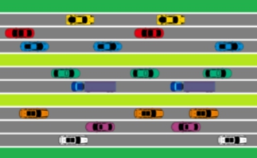
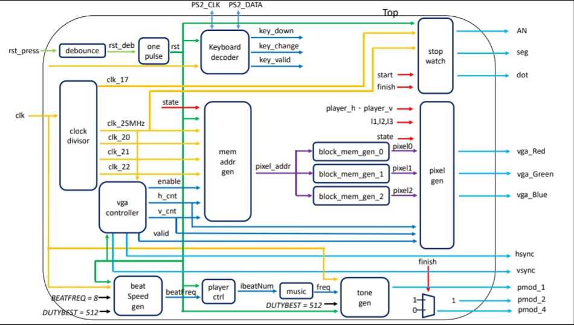

# Cross the Road

### Hardware Design and Lab (by professor Chun-Yi Lee)
#### designed by 張子宜、盧悅心
##### A game designed by Verilog.

## Introduction
#### You are a green block trying to cross the road and get to the other side.
#### Avoid the traffic flow. You will have to start over again if you get hit by a car.
#### Cross the road three times as fast as you can. The total time cost will be displayed on the 7 segment display.

